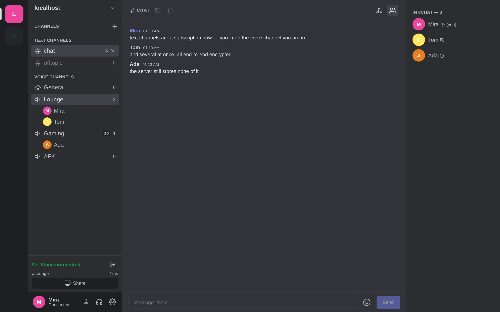
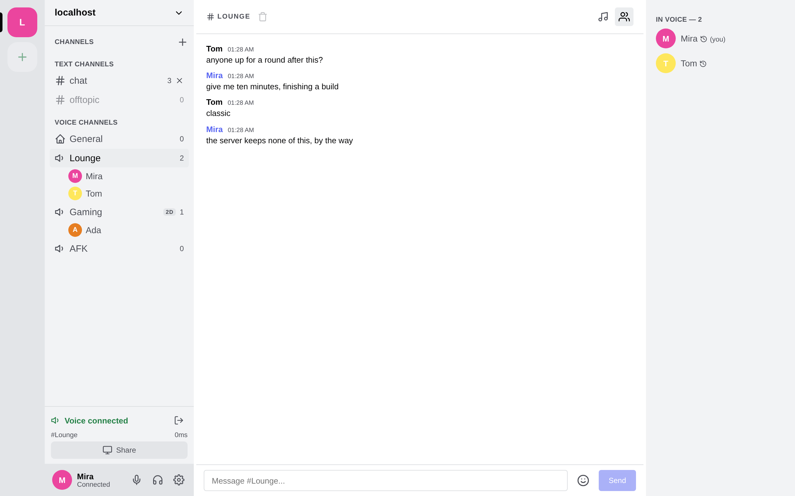
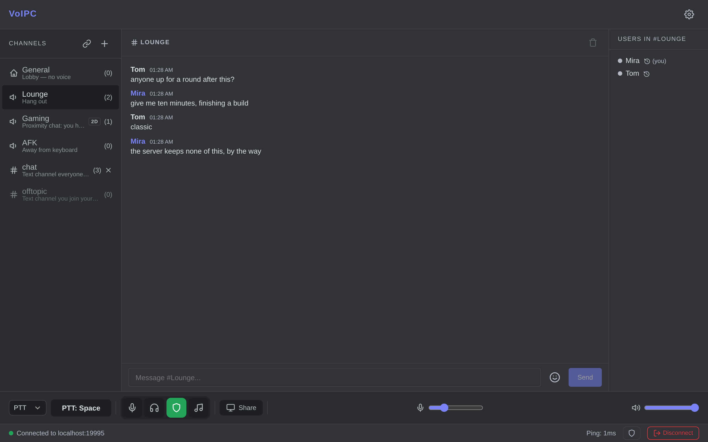
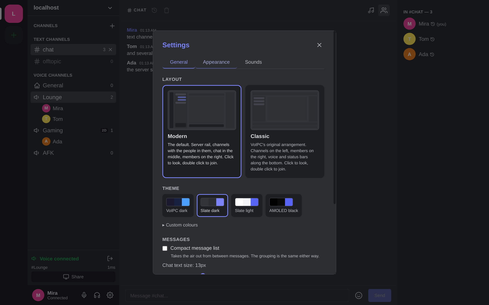

<p align="center">
  <br>
  <strong style="font-size: 2em;">VoIPC</strong>
  <br>
  <em>Privacy-first voice, video, and chat.</em>
  <br><br>
  <a href="#features">Features</a> &nbsp;&bull;&nbsp;
  <a href="#security">Security</a> &nbsp;&bull;&nbsp;
  <a href="#technology">Technology</a> &nbsp;&bull;&nbsp;
  <a href="#quick-start">Quick Start</a> &nbsp;&bull;&nbsp;
  <a href="#building">Building</a> &nbsp;&bull;&nbsp;
  <a href="#data-transparency">Data Transparency</a>
  <br><br>
  <a href="LICENSE"></a>
  
  
  
  
</p>

---

**VoIPC** is an encrypted, self-hosted voice/video/chat application. Think Discord or TeamSpeak, but with end-to-end encryption, zero data collection, and a server that never stores anything to disk.

No accounts. No telemetry. No compromises.

<p align="center">
  
</p>

<p align="center"><em>The Modern layout, which is what a new install starts in. Classic is one click away in Settings.</em></p>

<table>
  <tr>
    <td><br><sub>Text channels — a subscription, not a move</sub></td>
    <td><br><sub>Slate light, one of four palettes</sub></td>
    <td><br><sub>Classic, the original arrangement</sub></td>
  </tr>
  <tr>
    <td><br><sub>Appearance: layout, palette, every colour</sub></td>
    <td><br><sub>Screen sharing</sub></td>
    <td><br><sub>Connecting</sub></td>
  </tr>
</table>

<p align="center">
  <em>The site in <a href="website/">website/</a> has the same two layouts and four palettes as a live preview you can switch, rather than pictures of them.</em>
</p>

## Features

**Voice Chat**
- Opus codec at 48 kHz / 20ms frames / 48 kbps
- ML-based noise suppression (RNNoise via nnnoiseless)
- Voice Activity Detection with configurable threshold
- Push-to-Talk, VAD, and Always-On modes
- Global Push-to-Talk and mute/deafen hotkeys (work when window is unfocused)
- Opus in-band FEC — a lost packet is rebuilt from the one that follows it
- Adaptive jitter buffer (40 → 160 ms, grows only under packet loss)
- Per-user volume control, 0–400% mic input gain, mic test in settings
- Audio device hot-recovery when a device dies mid-call

**Mixer**
- A mixing desk in the centre column, with a tab of its own on a phone: one channel strip per
  person, yours pinned at the front, each with a level meter, a real vertical fader and a mute
- **A lane is a lane.** Your microphone on the way out and each voice on the way in carry the same
  four controls: an **effect**, plus **muffle**, **reverb** and **water** at 0–10 each
- Thirteen effect chains — five radio grades, five phone grades, megaphone, gramophone and robot —
  from one parametric chain with drive, hiss, crackle, bit-crush, ring modulation and a squelch
- What you put on your own microphone is encoded into your voice, so everyone hears it and no
  listener can switch it off. What you put on somebody else's changes only what you hear, and a
  game driving the channel takes those over while it runs

**Screen Sharing**
- H.264 encoding via FFmpeg by default — every viewer can watch, browsers included.
  H.265/HEVC is one setting away when everyone watching is on a desktop client
- Hardware acceleration: NVIDIA NVENC, Intel QSV, AMD AMF (libx264/libx265 software fallback) — shipped in Windows builds since 0.4.0
- **Share from a browser too**: Chromium encodes H.264, Firefox VP9 (it cannot encode H.264), and every viewer decodes both
- 480p / 720p / 1080p @ 30 or 60 fps (60 fps gets +50% bitrate)
- Desktop audio capture (64 kbps Opus)
- Pop-out viewer window and fullscreen viewing; chat stays visible while watching
- VPN-safe packet sizes (1280 bytes — fits inside WireGuard and OpenVPN tunnels)

**Interface**
- **Two layouts, switchable at any time.** **Modern** — server rail, channel sidebar showing who is
  in every channel, chat in the middle, members on the right — and
  **Classic**, the original: channels left, members right, voice and status bars along the bottom.
  In both, a click on a channel previews it and the button under the chat joins it
  (a double click on the row still works, where there is a mouse to do it with).
  Modern is the default, inspired by the chat apps most people arrive here from; you are asked
  which you want on the first connection, a layout you picked is kept, and Classic is one click
  away in Settings → Appearance
- Seeing who is in a channel you are not in respects the same rules as everything else: a channel
  that hides its members or has a password shows nobody, an anonymous one shows its pseudonyms, and
  the server decides — the client is told, it does not work it out
- On a phone the modern layout is the phone shape you already know: channels swipe in from the left,
  members from the right, with buttons for both
- **Four palettes** — Slate dark (the default), Slate light, VoIPC dark, AMOLED black — and every
  colour in them can be changed individually. A fresh install follows your system's light/dark
  setting and opens in Slate dark or Slate light; once you pick one it is yours and the system
  stops deciding. Compact messages, chat text size and an interface zoom
- Drag the modern layout's sidebars to any width, double-click a divider to put it back, and fold
  the member list away; each layout remembers its own widths

**Text Chat**
- Channel and direct messages, both end-to-end encrypted
- Encrypted local chat history (password-protected, AES-256-GCM)
- Encrypted poke notifications (like TeamSpeak pokes)
- Configurable chat history storage location
- Max 500 messages per channel stored locally

**Channels**
- Password-protected channels with invite system
- Per-channel media encryption keys
- Auto-cleanup of empty channels
- Configurable user limits
- Persistent rooms via `channels.json` on the server
- Invite links (`https://server:9987/#channel=name`): open the web client, or paste into the desktop connect dialog, and land in the channel — the password can ride in the fragment, which never reaches the server
- Newcomers get the last 50 channel messages from a member, end-to-end encrypted to them (opt-out in Settings → Data)

**Proximity Chat**
- A channel can be **2D** (a floor plan) or **3D** (height counts too), set when it is created and
  changeable afterwards by its creator or an admin; operators can switch the whole feature off
- Voices are placed left/right and get quieter with distance, using the constant-power pan law and
  the inverse distance model every other implementation converged on. Desktop and browser render it;
  Android gets the distance but not the panning yet
- **Check your own setup**: Settings → Spatial Audio → *Test 2D* / *Test 3D* circles a synthetic
  voice around you through the real mixer, with a live readout of where it is
- A **virtual room** shows everyone on a top-down plan. Arrange people yourself — that layout stays
  on your machine — or turn on *Sync my position*, after which you move only yourself and your
  position is broadcast to the channel, encrypted like voice. Presets: round table, class room, line
- **Game SDK**: a game mod can drive the positions instead, over a local WebSocket. It is the open
  alternative to the TeamSpeak plugins RP servers use (SaltyChat, YACA, TokoVOIP) — no plugin, no
  license server, players addressed by their VoIPC user id. Ranges, per-player volume, distance
  culling, 0–10 muffling and thirteen radio/phone effect chains, with speaking and mute state
  pushed back to the game. A ready-made FiveM resource is in [sdk/fivem-voipc/](sdk/fivem-voipc/);
  the protocol is in [docs/SDK.md](docs/SDK.md), and which games it reaches — and which it
  cannot — in [docs/GAMES.md](docs/GAMES.md)
- **One speaker, heard several ways at once.** Every other proximity plugin makes a mod choose:
  somebody is *either* on your radio *or* standing next to you. A player here carries up to three
  extra **layers**, each with its own placement, chain, **ear** and **delay** — so a colleague two
  metres away who keys their radio is heard twice, and the earpiece of somebody's phone leaks at
  *their* head rather than yours
- **MumbleLink**, for games that will not talk to a mod at all: Guild Wars 2 and a few others
  write your own position into shared memory, and VoIPC can read it — the position and nothing
  else in the block, not your account name and not which server you are on
- **What a game may do to you, you decide.** It places people and that is all, until you say
  otherwise: broadcasting your position to the channel and pressing your push-to-talk are each a
  switch in Settings, both off by default. A game silencing somebody by leaving them out is shown
  — they go grey in the member list — and switching the integration off hands everything back

**Quality of Life**
- Saved servers in the connect dialog, optional auto-connect
- System tray (close-to-tray keeps the call running) and desktop notifications
- Voice quality indicator: live ping + packet-loss % in the status bar
- One QUIC connection per client — connection migration survives NAT rebinds, Wi-Fi roams and address changes
- Auto-reconnect keeps trying for 5 minutes (laptop sleep, server restart)
- A blocked UDP port fails the connect with a clear error instead of a silent mute
- Screen share adapts bitrate and frame rate to what the link carries (viewers report loss, the sharer steps down)
- Server admin session: log in with the server's admin token (status bar shield) to kick users from any channel or from the server and to IP-ban them for 1 h, 24 h or until restart; bans are memory-only and listed with an Unban button

**Platform Support**

| | Linux | Windows | Android | Browser | macOS |
|---|:---:|:---:|:---:|:---:|:---:|
| Voice | Yes | Yes | Yes (Oboe) | Yes (WebCodecs) | Untested¹ |
| Text chat (E2E) | Yes | Yes | Yes | Yes (Signal in wasm) | — |
| Screen Capture | PipeWire + XDG Portal | Windows.Graphics.Capture | — | getDisplayMedia | — |
| Desktop Audio | PipeWire | WASAPI | — | Where the browser offers a track² | — |
| Screen Share Viewing | Yes | Yes | Yes (AMediaCodec) | Yes³ | — |

¹ There is no macOS-specific code yet; nothing is built or tested for it.
² Chromium offers tab and system audio in its share picker; Firefox on Linux offers none, and
the audio indicator shows "no signal".
³ Every client decodes H.264, VP8 and VP9, so any browser can watch any share encoded in them —
which is why H.264 is the default. H.265 is the exception: browsers decode it only where the
platform provides it (Chrome/Edge on Windows and macOS, Safari 17+, Chrome on Android; Firefox
nowhere, and no browser on Linux). A viewer that cannot decode a share's codec is told so instead
of showing a black frame.

**Web client (browser)**

The server hosts the web client itself: open `https://your-server:9987` and you get the same
UI as the desktop app, with the Signal Protocol and AES-256-GCM media crypto compiled to
WebAssembly. Needs Chrome 97+, Edge 98+, Firefox 130+, or Safari 26.4+ (WebTransport + WebCodecs);
Chromium and Firefox are both covered by the end-to-end test, including sharing a screen and
watching one. Sharing from a browser uses the browser's own picker; VoIPC picks the codec by
trying to encode with it, so Chromium shares H.264 and Firefox VP9 (its WebCodecs H.264 encoder
is broken, [Bugzilla 1918769](https://bugzilla.mozilla.org/show_bug.cgi?id=1918769)).

## Security

VoIPC encrypts everything at multiple layers. The server acts as a blind relay — it forwards encrypted packets without ever being able to read them.

### Layer 1: Transport — TLS on every connection

All TCP control traffic is encrypted with TLS 1.2+ via **rustls** (pure-Rust, no OpenSSL). For self-signed server certs, the client pins the certificate fingerprint per `host:port` on first connect via **TOFU** (`TofuCertVerifier`) and aborts the handshake if it ever changes. If a server legitimately replaced its certificate, the connect dialog offers *Forget pinned certificate*; the next connect pins the new one. Plaintext connections are never accepted.

### Layer 2: End-to-End Messages — Signal Protocol

Chat messages (channel and DM) use the **Signal Protocol** from the official [libsignal](https://github.com/signalapp/libsignal) crate by Signal Foundation:

- **X3DH** (Extended Triple Diffie-Hellman) for session establishment
- **Double Ratchet** algorithm — new key for every message
- **Curve25519** identity keys (32-byte) with Ed25519 signed pre-keys
- **100 one-time pre-keys** per user, auto-replenished
- **Sender Keys** for efficient group/channel message encryption
- **Perfect Forward Secrecy** — a compromised key cannot decrypt past messages. For channel chat the matching guarantee runs the other way and is what key rotation is for: a chain key stolen today would read *future* messages, so leaving a channel starts a new chain
- **Ephemeral identities by design** — a fresh identity key pair is generated for every connection and never written to disk. There are no accounts and nothing to fingerprint or link across sessions. The trade-off is explicit: pre-key bundles come from the server, so protection against an *actively malicious* server substituting keys during session setup is not a goal; protection against a passive or compromised-at-rest server is.

### Layer 3: Media — AES-256-GCM on every packet

All voice, video, and screen share audio is encrypted with **AES-256-GCM** (via the `ring` crate):

- Per-channel 256-bit symmetric key, randomly generated
- Deterministic nonce: `stream_id(4) || sequence(4) || type+fragment(4)` — prevents reuse by construction; domain-separated per stream type (voice / screen audio / video). `stream_id` is four random bytes the **sender** picks for itself on joining, carried in the packet header. Two members of a channel encrypt under the same key, so it is what keeps them off each other's nonces — and it is chosen by the client rather than the server, because a server that handed two speakers the same identifier would otherwise get the XOR of their voices
- 16-byte authentication tag on every packet — detects tampering
- AAD (Additional Authenticated Data) binds channel_id + packet_type — blocks cross-channel replay
- Mandatory key rotation after ~4.3 billion packets
- Media keys are generated by the first member of a channel and handed to each joiner over the pairwise Signal session; the server relays the encrypted blob and never holds a media key
- **Rotated when somebody leaves**, so the key does not outlive the membership it was given for: the lowest remaining user id mints the next generation and hands it to the others, with no coordination and nobody elected by the server. The generation before stays usable for a moment, so packets already in flight are not an audible gap — which is also the window in which a member who just left can still read what was sent under the old key. Generations are a counter that wraps rather than a number that runs out, so no member can send the last one on the way out and freeze the channel on the key they are walking away with
- **Taken only from a member of the channel it names**, and only for the room the client is standing in. A media key is the key the microphone encrypts under, so a key offered by somebody the roster does not put in the channel is refused before it is even opened
- Plaintext media packet types are never sent and are dropped by both server and clients

### Layer 4: Local Storage — AES-256-GCM + PBKDF2

Client-side data at rest:

- Chat history encrypted with **PBKDF2-HMAC-SHA256** (600,000 iterations) + **AES-256-GCM**
- 32-byte random salt + 12-byte random nonce per file
- Signal Protocol state is never stored (see *Ephemeral identities* above)
- All secrets wrapped in `Zeroizing<T>` — memory-zeroized on drop

### Layer 5: Zero-Knowledge Server

- Server **never** sees plaintext messages (encrypted client-side)
- Server **never** stores chat history (no persistence, no disk writes)
- Server **never** decodes voice/video (SFU architecture — relays encrypted packets)
- Server **never** logs conversations (memory-only state, restart = clean slate)

### What the comparison looks like

| | VoIPC | Discord | TeamSpeak |
|---|---|---|---|
| E2E Text Chat | Signal Protocol | No | No |
| E2E Voice & Video | AES-256-GCM | Partial (DAVE — voice/DM calls) | No |
| Self-Hosted | Yes | No | Yes |
| Open Source | MIT | No | No |
| Account Required | No | Yes | No |
| Data Collection | None | Extensive | Some |
| Server Persistence | None | Everything | Everything |
| Screen Share Codec | H.264 or H.265, HW-accel | H.264/VP8 | Limited |

## Technology

### Architecture

```
┌──────────────┐      QUIC · TLS 1.3        ┌──────────────┐      QUIC · TLS 1.3        ┌──────────────┐
│   Client A   │◄──────────────────────────►│    Server    │◄──────────────────────────►│   Client B   │
│  Tauri 2 App │  control stream + media    │  Rust Binary │  control stream + media    │  Tauri 2 App │
│  Rust+Svelte │  datagrams, AES-256-GCM    │  Tokio SFU   │  datagrams, AES-256-GCM    │  Rust+Svelte │
└──────────────┘                             └──────┬───────┘                            └──────────────┘
                                              Relays only —  │  HTTPS page (HTTP/2) +
                                              never decodes  │  the same QUIC endpoint
                                                      ┌──────┴───────┐
                                                      │  Web Client  │
                                                      │ Svelte+wasm  │
                                                      └──────────────┘
```

- **One QUIC (WebTransport) connection** per client, TLS 1.3 only: control messages (auth,
  channels, chat, encryption key exchange) on a bidirectional stream, voice and screen-share
  audio as datagrams, each video frame on its own unidirectional stream. NAT rebinds and
  address changes are handled by QUIC connection migration
- **SFU** (Selective Forwarding Unit) — server relays encrypted packets without decoding
- **HTTP/2 page** for browsers: the same origin serves the web client, which then opens the
  same QUIC endpoint the desktop app uses. Browsers get no plaintext the native clients
  don't — all encryption happens in the page, in WebAssembly

### Stack

| Layer | Technology | Details |
|---|---|---|
| **Audio** | Opus via audiopus | 48 kHz, mono, 20ms frames, 48 kbps, FEC, DTX |
| **Noise Suppression** | nnnoiseless (RNNoise) | ML-based, 480-sample frames at 48 kHz |
| **Video Codec** | H.264 (default) or H.265 via FFmpeg 8 | NVENC → QSV → AMF → libx264/libx265 fallback; browsers also send VP9/VP8 |
| **Encryption** | libsignal-protocol + ring | Signal Protocol for messages, AES-256-GCM for media |
| **TLS** | rustls 0.23 + ring | Pure-Rust TLS 1.2+, TOFU cert pinning |
| **Serialization** | postcard | Binary, no_std compatible, minimal overhead |
| **Server Runtime** | Tokio | Async, single-binary, DashMap lock-free concurrency |
| **Client Backend** | Tauri 2 (Rust) | Native IPC, audio/video/crypto all in Rust |
| **Client Frontend** | Svelte 5 + TypeScript | Runes ($state, $derived, $effect), Vite 6 |
| **Web Client** | WebAssembly + WebCodecs | Same Svelte UI; Signal + media crypto in wasm, Opus and video via WebCodecs, WebTransport for control and media |
| **Audio I/O** | cpal / Oboe | ALSA (Linux), WASAPI (Windows), Oboe (Android) |
| **Screen Capture** | Platform-native | PipeWire ScreenCast (Linux), Windows.Graphics.Capture (Windows) |

### Protocol Details

| Metric | Value |
|---|---|
| Voice packet header | 9 bytes (11 encrypted) |
| Video packet header | 15 bytes (17 encrypted) |
| Max voice packet | 512 bytes |
| Max video packet | 1,280 bytes |
| Max control message | 64 KiB |
| Protocol version | v8 |
| Default port | 9987 — UDP for QUIC (all clients), TCP for the browser page |

### Project Structure

```
VoIPC/
├── crates/
│   ├── voipc-protocol/     # Message types, packet formats, codec
│   ├── voipc-server/       # Server binary (QUIC/WebTransport endpoint + HTTPS page)
│   ├── voipc-audio/        # Capture, playback, Opus, RNNoise, VAD, jitter buffer
│   ├── voipc-video/        # H.264/H.265 encoding, H.264/H.265/VP8/VP9 decoding, fragment assembly
│   ├── voipc-crypto/       # Signal Protocol, AES-256-GCM, key management
│   └── voipc-web/          # wasm build of protocol + crypto for the browser client
├── client/
│   ├── src-tauri/src/      # Tauri Rust backend (network, crypto, state, commands)
│   │   ├── screenshare/    # Platform-specific capture (linux.rs, windows.rs)
│   │   ├── transport.rs    # QUIC connection, certificate pinning (TOFU)
│   │   ├── network.rs      # Control/media tasks, Signal session setup
│   │   ├── crypto.rs       # Chat history encryption (PBKDF2 + AES-256-GCM)
│   │   ├── app_state.rs    # Central app state (connections, audio, crypto)
│   │   └── commands.rs     # Tauri IPC command handlers
│   └── src/
│       ├── lib/
│       │   ├── components/ # Svelte 5 components
│       │   └── stores/     # Reactive state (channels, chat, voice, etc.)
│       ├── web/            # Browser backend: WebTransport, Signal orchestration,
│       │                   #   WebCodecs audio/video, Tauri API shims
│       └── App.svelte      # Root component
├── website/                # Project website (single HTML file)
├── tools/                  # Build task runner — npm run <task>, one per build
├── setup.sh / setup.ps1    # One-command dependency installer (Rust, Node, system libs)
├── test-web.sh             # Headless two-browser end-to-end test of the web client
└── Cargo.toml              # Workspace root
```

## Quick Start

### Server

```bash
# Build
cargo build -p voipc-server --release

# Generate self-signed TLS certificate (browsers check the subjectAltName —
# put the host name / IP your users will type)
mkdir -p certs
openssl req -x509 -newkey ec \
  -pkeyopt ec_paramgen_curve:prime256v1 \
  -keyout certs/server.key -out certs/server.crt \
  -days 365 -nodes -subj "/CN=voipc" \
  -addext "subjectAltName=DNS:your-server.example,IP:203.0.113.5"

# Run
./target/release/voipc-server
```

The server listens on port **9987** by default: UDP for the QUIC endpoint every client
connects to, TCP for the browser page. Configure via `server.toml`:

```toml
host = "::"               # Bind address — "::" serves IPv6 and IPv4 from one listener; "0.0.0.0" for IPv4 only
tcp_port = 9987           # HTTPS page for the browser client
udp_port = 9987           # QUIC endpoint (all clients) — keep equal to tcp_port so one host:port reaches both
max_users = 64
max_connections_per_ip = 32   # A browser client holds two of these, a native client one — so 32 is sixteen browser users behind one NAT
cert_path = "certs/server.crt"
key_path = "certs/server.key"
admin_token = "change-me"  # optional; unset = a random token is printed in the log at every start
```

> **IPv6:** `host = "::"` is the default and serves both families from one listener (a host with IPv6 disabled falls back to `0.0.0.0` automatically). Do not pin `host` to a concrete IPv4 address while your domain publishes an AAAA record: the browser client then fails while everything else looks healthy, because the page and `/wt.json` are TCP and Chrome quietly falls back to IPv4 after the refused IPv6 attempt, while the WebTransport session is UDP and has no such fallback — it dies with `ERR_QUIC_PROTOCOL_ERROR`.

> **VPN / multi-homed setups:** If clients connect via a domain name (e.g. `vpn.example.com`) that resolves to a specific IP, set `host` to that IP. Otherwise the server may send QUIC packets from the wrong interface and the handshake never completes. All options can also be passed as CLI flags (`--host`, `--tcp-port`, `--udp-port`, etc.).

Runtime settings in `server_settings.json`:

```json
{
  "empty_channel_timeout_secs": 300,
  "max_channels": 50,
  "max_channel_name_len": 32,
  "proximity_enabled": true,
  "game_token": null
}
```

`proximity_enabled: false` switches proximity chat off for the whole server: every channel is served as non-positional, requests to enable it are refused, and position beacons are not relayed.

`game_token` (unset by default) is a bearer token a **game server** may present to `POST /game/v1/routes`, which narrows who hears whom inside a channel whose `routed` flag is on. Unset, that endpoint answers 404 and this server has no idea games exist. It is not the admin token and is deliberately much weaker: no session list, no names, no kick, no bans — only "these players may hear each other, for the next few seconds", as opaque ids it forgets.

**Persistent channels** (optional): drop a `channels.json` next to the binary to pre-create long-lived rooms that survive restarts. See [channels.example.json](channels.example.json) — plaintext `password` fields are hashed to SHA-256 on first load and the file is rewritten atomically. Per channel:

| Option | Default | Effect |
|---|---|---|
| `proximity` | `"off"` | `"2d"` or `"3d"` makes it a proximity room |
| `hidden` | `false` | Not listed in the sidebar for non-admins. It can still be joined — by an invite link, by the game SDK, or by anyone who knows it is there — so it is out of the way, not locked. Give a channel a `password` if you need it shut, and both if it is the one your game drives |
| `anonymous` | `false` | Members see each other as `Guest-1234`, a fresh name per visit. The server substitutes it everywhere, so no client ever learns the real one; admins see the real names, and no chat history is handed over in such a channel. Voice channels only, and it hides a name rather than a person: user ids are the same everywhere, so somebody who is also in a channel where you can see them can be matched up by id — which is why a text channel, one you are in *besides* the voice channel you stand in, may not be anonymous at all |
| `screen_share` | `true` | `false` refuses screen sharing there |
| `hide_members` | `false` | Non-admins see no member list, only whoever is speaking (and can still adjust their volume). Nobody outside is told who joins or leaves either — only that the count changed — which is the same rule a password channel follows |
| `routed` | `false` | The server forwards each voice only to whoever should hear it, instead of to every member. For a channel a game drives, where "every member" can be a whole map. **The one option that tells this server anything about who hears whom** — members in such a channel say which of the others they want to hear, and a game server with `game_token` may narrow that further. Positions, names and audio stay as unreadable to it as ever. Everyone joining is told, and the channel is marked **R** |
| `text` | `false` | Makes it a **text channel**: no voice, no screen share, no proximity. Joining one is a subscription rather than a move, so any number can be open at once and none of them costs the voice channel you stand in |
| `message_ttl_secs` | `0` | A **message destruction timer**: seconds a message written here lives before every client deletes it, `0` for none. Up to 30 days. The server stores no chat and deletes nothing — this is what the channel tells its members, and each client stamps it on what it sends, inside the encryption where the relay cannot reach it. It applies to what is written from then on, not to what people already have |
| `auto_join` | `false` | Only with `text`. Clients join this channel on connect. A user who leaves it is not brought back — the client remembers that, which is why the server joins nobody by itself. There is no limit on how many a client holds: the budgets that pay for joining them are sized from how many channels this server has |

The creator of a channel, or any admin, can change these at runtime through the channel's gear icon. Channels from `channels.json` have no creator, so those are admin-only.

**Text channels.** A voice channel is still one at a time: joining another moves you. A text channel is not — you subscribe to as many as you like, read them while sitting in a voice room, and leave one from the ✕ on its row. Clicking a text channel you are not in reads it rather than joining it; entering is a button in the chat pane, so a stray click never puts you back in a channel you left. Anyone can create one at runtime too (the + button, then *Text*), and like any user-created channel it disappears once the last member leaves and the empty-channel timeout passes. Messages are end-to-end encrypted the same way voice-channel chat is, one sender-key group per channel, and each message is bound to its channel inside the ciphertext — a relay cannot show it as belonging to another one. When somebody leaves a channel, the next message sent there starts a fresh key chain, so a former member stops being able to read along.

**Messages can be given a destruction timer.** Off everywhere by default. A channel's creator, or an admin, sets one from the channel's gear icon — five minutes to seven days — and from then on every message written there is deleted by every client once its time is up, including from the copies members have handed to people who joined later. A direct message has no channel to take that from, so there the clock icon in the chat header is your own: it travels with the messages you send, and the other side deletes them when it runs out.

The timer rides inside the encryption, next to the message, so the relay can neither read it nor change it. A deadline is worked out once, when a message arrives, from the message's own timestamp — which is why every copy of it goes at the same moment rather than a few minutes apart. What a member re-sharing a conversation claims about a message is only ever the outer bound: the channel's own timer applies to what they hand over too, including to a message they strip it from, and a copy of something you already hold can bring its deletion forward but never push it back. What that does not do is make a member trustworthy: somebody who was there can always keep their own copy of what they read, whatever the timer says. It is a rule about the app, not about people.

**Chat history is opt-in, shared between members, and yours to delete.** The server stores no messages, so a channel's past reaches a newcomer only because members offer it.

Because it reaches them that way, it is that member's word: identities are ephemeral and never stored, so there is nothing that signs an archived message and nothing to check one against. Messages that arrive as history are therefore shown as second-hand, and stay second-hand when they are passed on — a member who invents a conversation and attributes it to somebody else can be believed, but never mistaken for the person they are quoting.

- **Who shares** is visible: a member who answers requests is marked in the member list. It is one flag per person, like mute, and the only thing about chat the server is told — it has always seen the requests go past. Turn it off under Settings → Data
- **Several people are asked, and the answers are merged.** Whoever was away holds the older half of a conversation, whoever just arrived holds only the newest. A newcomer asks up to three members who share, and what comes back is folded into one history in order. Each message carries an id minted by its sender inside the encryption, so two copies of the same message are recognised as one; a divider shows which part came from whom
- **Deleting is permanent.** Clearing a channel records what was there, and nothing older is merged back in — so what you deleted stays deleted, however often a member re-offers it. The history button in the chat header asks the sharers again and takes that back, for when you cleared it by accident
- **History is kept per server**, and on desktop in an encrypted file you unlock with a password (Settings → Data, or turn it off and keep chat in memory only). Two servers' `#general` are two conversations, which also means a server cannot ask for what its users wrote somewhere else
- **Conversations are filed by server and by the name of the person**, so a DM you had yesterday is not shown as one with whoever happens to hold that user id today. Which also means a name is what a conversation follows: on a server where somebody else takes a name after its owner leaves, the two look like one person to your archive — there are no accounts, and the server only keeps a name unique while the person holding it is online
- **What the server can still do:** it decides who is in a channel, so it can place somebody there and the members will hand them a key. End-to-end encryption means the server cannot read what is said — not that it cannot add a listener. It has to do it in the open, though: a client accepts a sender key, accepts a media key, answers a request for history and shows a message only from somebody the roster says is in the channel with it, so an added listener is one the member list shows. Accounts with lasting identities are what would close the gap entirely, and they are not here yet

**Server administration:** there are no accounts; any connected user becomes admin for their session by entering the admin token (status bar → shield icon). Set `admin_token` in `server.toml`, pass `--admin-token`, or export `VOIPC_ADMIN_TOKEN`; without one the server prints a fresh random token in its log at every start. Admins can kick users from channels or from the server and ban an IP for 1 h, 24 h or until restart — everyone behind that IP is affected, and bans live in memory only. Other users see a shield next to an admin's name. Three wrong tokens disconnect the session.

### Client

```bash
# Linux
./setup.sh       # Install system dependencies, Rust and Node
npm run build    # Release build

# Windows (PowerShell as Administrator)
.\setup.ps1
npm run build
```

Every build task runs through `npm run <task>` on both platforms;
`node tools/voipc.mjs --help` lists them.

Or manually:

```bash
cd client
npm install
npx tauri dev     # Dev build + run
npx tauri build   # Release build
```

Or build portable release binaries via Docker (no local dependencies needed):

```bash
npm run release    # Outputs release/VoIPC_*.AppImage + release/voipc-server + release/VoIPC-web-*.tar.gz
```

Without Docker it falls back to a host build — the server and the web bundle, no AppImage —
and tells you what it skipped and why.

See [BUILDING.md](BUILDING.md) for detailed platform-specific instructions and dependency lists.

### Web client

Nothing to install: point a browser at the server.

```
https://your-server:9987
```

The server binary serves the web client over HTTP/2 and carries voice, video and control
messages over WebTransport on the same UDP port the desktop app uses (**9987**) — no extra
port to open. With a self-signed certificate the browser shows a warning on the first visit;
accept it once and the app works (generate the certificate with a `subjectAltName`, see the
openssl line above, or use a real certificate from a CA). Browsers pin the QUIC endpoint by
certificate hash, so for them the server presents a short-lived certificate it generates,
rotates, and publishes by hash to the page — there is nothing to configure. Desktop clients
get the operator certificate on the same endpoint and pin it on first use as before.

Requires Chrome 97+, Edge 98+, Firefox 130+, or Safari 26.4+ for voice, chat and watching a
share (H.265 shares are the exception — see the platform table). Sharing your own screen
additionally needs `VideoEncoder` and `getDisplayMedia`, which rules out most mobile browsers;
it is tested on Chromium 152 and Firefox 155, and the Share button hides itself where the
browser cannot do it. In Firefox the output-device picker does nothing — routing audio to a chosen device is a
Chromium extension the other engines have not implemented.

To build it yourself:

```bash
npm run web        # wasm + Vite bundle, then a server binary that embeds it
npm run test:web   # headless two-browser end-to-end check (voice, chat, DMs, screen share,
                   # proximity, and a run through the real UI in the Chromium lanes)
npm --prefix client test   # browser-side unit tests (spatial maths, room presets)
```

## Data Transparency

### What the server stores (in memory only)

- Active usernames and channel memberships
- Channel names, descriptions, passwords (`Zeroizing<String>` — cleared on drop)
- Connection metadata (IP addresses while connected)
- Media encryption keys per channel (`Zeroizing<[u8; 32]>`)
- Pre-key bundles for Signal session establishment

**Nothing is written to disk. Server restart = complete clean slate.**

### What the server never sees

- Message contents — encrypted with Signal Protocol before leaving your device
- Voice/video content — encrypted with AES-256-GCM before transmission
- Chat history — stored only on your device, encrypted
- Your private keys — only public keys are exchanged
- Where you stand in a proximity room — positions are encrypted with the channel key like voice; the
  relay sees only that a member is sharing one. Positions a game feeds in stay on your machine
  unless you switch on *Let a game broadcast my position* — and then only your own goes out, still
  encrypted, still unreadable to the relay, though every member of the channel can read it
- Which radio channel anyone is on, or that radio channels exist. Radio entitlement is a job check
  in the game server's own resource; the relay forwards encrypted audio to a VoIPC channel and
  knows nothing else. The cost is worth stating: an honest client renders only what it should, and
  a patched one can hear the whole channel — exactly as with SaltyChat, YACA and TokoVOIP

### What the server sees in a routed channel

A channel can be marked **routed** (off by default; see the channel options above). There, and
only there, the relay is told one extra thing so it can forward each voice to the people who
should hear it instead of to everybody:

- **What it learns:** for each member, the set of other members they currently want to hear, as
  user ids, changing a few times a second. If the game server is connected to it, that server's
  own answer for who *may* hear whom, as opaque ids salted per run — which it resolves on receipt
  and then forgets
- **What it still never learns:** any position, range or distance; any radio channel, call or job
  name; any name it did not already have; and any audio it can read. The routing endpoint refuses
  a request carrying a field it does not recognise, so a coordinate cannot reach it by accident,
  and there is no way to read anything back out of it
- **It is not cryptographic separation.** The channel shares one media key, so this stops packets
  reaching a client, not a client from reading the packets it gets. Radio entitlement is still a
  job check in the game server's own resource
- Everyone joining such a channel is told this, in a notice they have to dismiss, and the channel
  carries an **R** in the list

### What your device stores

- Encrypted chat history (`VOIP` binary format, password-protected)
- Audio/video settings and device preferences
- Max 500 messages per channel, auto-rotated

### What is never stored anywhere

- No analytics or telemetry
- No user accounts or profiles
- No server-side message logs
- No tracking of any kind
- No third-party data sharing

## Contributing

VoIPC is MIT licensed. Contributions are welcome.

1. Fork the repository
2. Create a feature branch
3. Make your changes
4. Run `cargo build --workspace` to verify everything compiles
5. Submit a pull request

## License

[MIT](LICENSE)

---

<p align="center">
  <em>Built with Rust, Svelte, and paranoia.</em>
  <br>
  <sub>No cookies. No tracking. Not even on this README.</sub>
</p>
