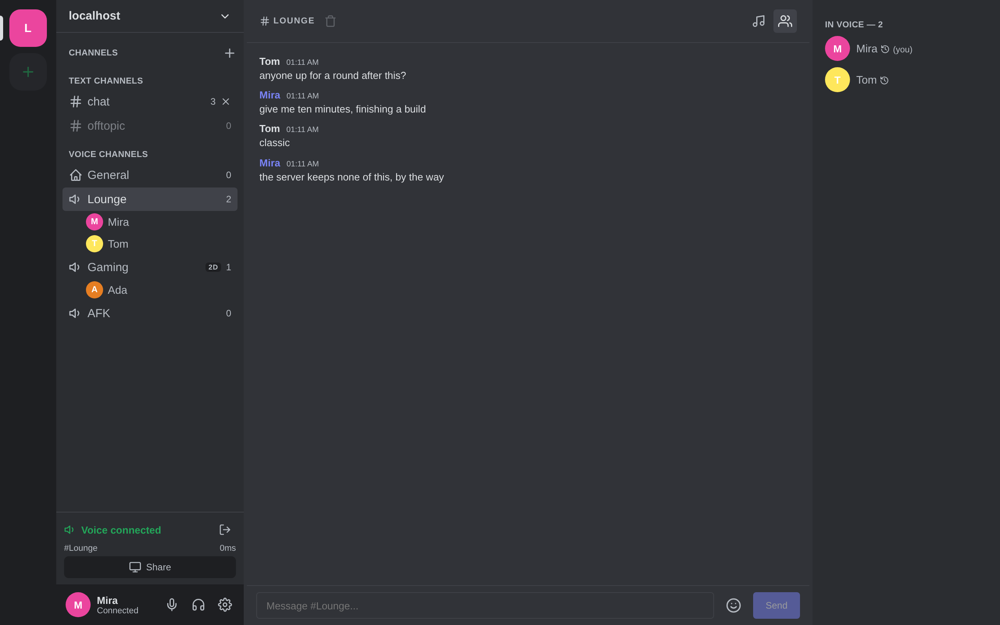
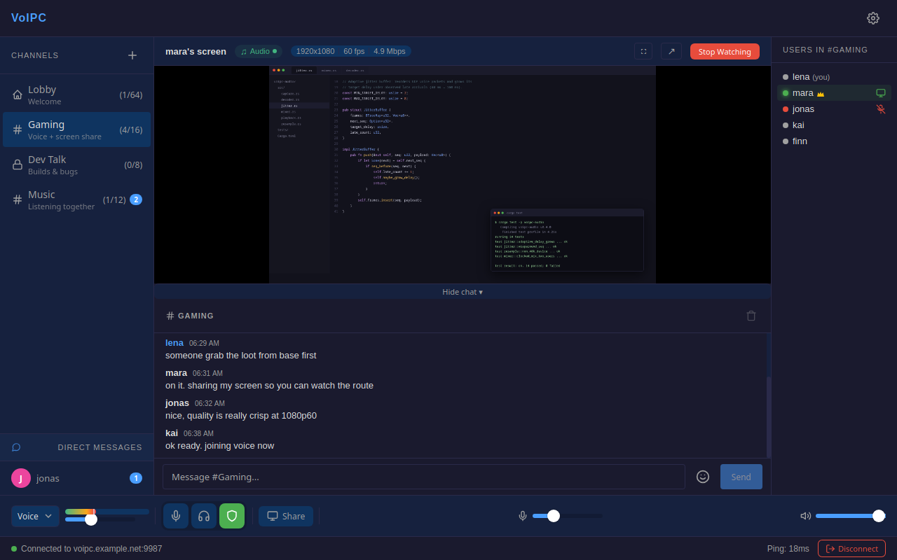
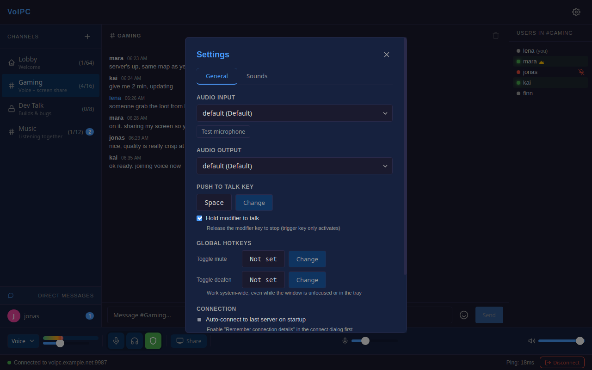
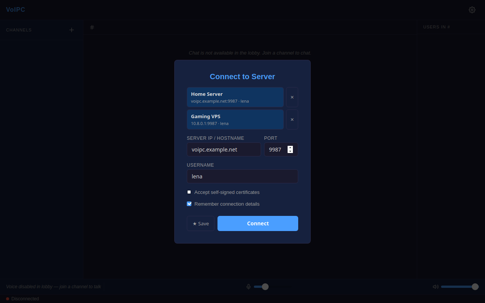

<p align="center">
  <br>
  <strong style="font-size: 2em;">VoIPC</strong>
  <br>
  <em>Privacy-first voice, video, and chat.</em>
  <br><br>
  <a href="#features">Features</a> &nbsp;&bull;&nbsp;
  <a href="#security">Security</a> &nbsp;&bull;&nbsp;
  <a href="#technology">Technology</a> &nbsp;&bull;&nbsp;
  <a href="#quick-start">Quick Start</a> &nbsp;&bull;&nbsp;
  <a href="#building">Building</a> &nbsp;&bull;&nbsp;
  <a href="#data-transparency">Data Transparency</a>
  <br><br>
  <a href="LICENSE"></a>
  
  
  
  
</p>

---

**VoIPC** is an encrypted, self-hosted voice/video/chat application. Think Discord or TeamSpeak, but with end-to-end encryption, zero data collection, and a server that never stores anything to disk.

No accounts. No telemetry. No compromises.

<p align="center">
  
</p>

<table>
  <tr>
    <td></td>
    <td></td>
    <td></td>
  </tr>
</table>

## Features

**Voice Chat**
- Opus codec at 48 kHz / 20ms frames / 48 kbps
- ML-based noise suppression (RNNoise via nnnoiseless)
- Voice Activity Detection with configurable threshold
- Push-to-Talk, VAD, and Always-On modes
- Global Push-to-Talk and mute/deafen hotkeys (work when window is unfocused)
- Opus in-band FEC — a lost packet is rebuilt from the one that follows it
- Adaptive jitter buffer (40 → 160 ms, grows only under packet loss)
- Per-user volume control, 0–400% mic input gain, mic test in settings
- Audio device hot-recovery when a device dies mid-call

**Screen Sharing**
- H.264 encoding via FFmpeg by default — every viewer can watch, browsers included.
  H.265/HEVC is one setting away when everyone watching is on a desktop client
- Hardware acceleration: NVIDIA NVENC, Intel QSV, AMD AMF (libx264/libx265 software fallback) — shipped in Windows builds since 0.4.0
- **Share from a browser too**: Chromium encodes H.264, Firefox VP9 (it cannot encode H.264), and every viewer decodes both
- 480p / 720p / 1080p @ 30 or 60 fps (60 fps gets +50% bitrate)
- Desktop audio capture (64 kbps Opus)
- Pop-out viewer window and fullscreen viewing; chat stays visible while watching
- VPN-safe packet sizes (1280 bytes — fits inside WireGuard and OpenVPN tunnels)

**Text Chat**
- Channel and direct messages, both end-to-end encrypted
- Encrypted local chat history (password-protected, AES-256-GCM)
- Encrypted poke notifications (like TeamSpeak pokes)
- Configurable chat history storage location
- Max 500 messages per channel stored locally

**Channels**
- Password-protected channels with invite system
- Per-channel media encryption keys
- Auto-cleanup of empty channels
- Configurable user limits
- Persistent rooms via `channels.json` on the server
- Invite links (`https://server:9987/#channel=name`): open the web client, or paste into the desktop connect dialog, and land in the channel — the password can ride in the fragment, which never reaches the server
- Newcomers get the last 50 channel messages from a member, end-to-end encrypted to them (opt-out in Settings → Data)

**Proximity Chat**
- A channel can be **2D** (a floor plan) or **3D** (height counts too), set when it is created and
  changeable afterwards by its creator or an admin; operators can switch the whole feature off
- Voices are placed left/right and get quieter with distance, using the constant-power pan law and
  the inverse distance model every other implementation converged on. Desktop and browser render it;
  Android gets the distance but not the panning yet
- **Check your own setup**: Settings → Spatial Audio → *Test 2D* / *Test 3D* circles a synthetic
  voice around you through the real mixer, with a live readout of where it is
- A **virtual room** shows everyone on a top-down plan. Arrange people yourself — that layout stays
  on your machine — or turn on *Sync my position*, after which you move only yourself and your
  position is broadcast to the channel, encrypted like voice. Presets: round table, class room, line
- **Game SDK**: a game mod can drive the positions instead, over a local WebSocket. It is the open
  alternative to the TeamSpeak plugins RP servers use (SaltyChat, YACA, TokoVOIP) — no plugin, no
  license server, players addressed by their VoIPC user id. Ranges, per-player volume, distance
  culling and 0–10 muffling are supported; radio and phone effects come later. See [docs/SDK.md](docs/SDK.md)

**Quality of Life**
- Saved servers in the connect dialog, optional auto-connect
- System tray (close-to-tray keeps the call running) and desktop notifications
- Voice quality indicator: live ping + packet-loss % in the status bar
- One QUIC connection per client — connection migration survives NAT rebinds, Wi-Fi roams and address changes
- Auto-reconnect keeps trying for 5 minutes (laptop sleep, server restart)
- A blocked UDP port fails the connect with a clear error instead of a silent mute
- Screen share adapts bitrate and frame rate to what the link carries (viewers report loss, the sharer steps down)
- Server admin session: log in with the server's admin token (status bar shield) to kick users from any channel or from the server and to IP-ban them for 1 h, 24 h or until restart; bans are memory-only and listed with an Unban button

**Platform Support**

| | Linux | Windows | Android | Browser | macOS |
|---|:---:|:---:|:---:|:---:|:---:|
| Voice | Yes | Yes | Yes (Oboe) | Yes (WebCodecs) | Untested¹ |
| Text chat (E2E) | Yes | Yes | Yes | Yes (Signal in wasm) | — |
| Screen Capture | PipeWire + XDG Portal | Windows.Graphics.Capture | — | getDisplayMedia | — |
| Desktop Audio | PipeWire | WASAPI | — | Where the browser offers a track² | — |
| Screen Share Viewing | Yes | Yes | Yes (AMediaCodec) | Yes³ | — |

¹ There is no macOS-specific code yet; nothing is built or tested for it.
² Chromium offers tab and system audio in its share picker; Firefox on Linux offers none, and
the audio indicator shows "no signal".
³ Every client decodes H.264, VP8 and VP9, so any browser can watch any share encoded in them —
which is why H.264 is the default. H.265 is the exception: browsers decode it only where the
platform provides it (Chrome/Edge on Windows and macOS, Safari 17+, Chrome on Android; Firefox
nowhere, and no browser on Linux). A viewer that cannot decode a share's codec is told so instead
of showing a black frame.

**Web client (browser)**

The server hosts the web client itself: open `https://your-server:9987` and you get the same
UI as the desktop app, with the Signal Protocol and AES-256-GCM media crypto compiled to
WebAssembly. Needs Chrome 97+, Edge 98+, Firefox 130+, or Safari 26.4+ (WebTransport + WebCodecs);
Chromium and Firefox are both covered by the end-to-end test, including sharing a screen and
watching one. Sharing from a browser uses the browser's own picker; VoIPC picks the codec by
trying to encode with it, so Chromium shares H.264 and Firefox VP9 (its WebCodecs H.264 encoder
is broken, [Bugzilla 1918769](https://bugzilla.mozilla.org/show_bug.cgi?id=1918769)).

## Security

VoIPC encrypts everything at multiple layers. The server acts as a blind relay — it forwards encrypted packets without ever being able to read them.

### Layer 1: Transport — TLS on every connection

All TCP control traffic is encrypted with TLS 1.2+ via **rustls** (pure-Rust, no OpenSSL). For self-signed server certs, the client pins the certificate fingerprint per `host:port` on first connect via **TOFU** (`TofuCertVerifier`) and aborts the handshake if it ever changes. If a server legitimately replaced its certificate, the connect dialog offers *Forget pinned certificate*; the next connect pins the new one. Plaintext connections are never accepted.

### Layer 2: End-to-End Messages — Signal Protocol

Chat messages (channel and DM) use the **Signal Protocol** from the official [libsignal](https://github.com/signalapp/libsignal) crate by Signal Foundation:

- **X3DH** (Extended Triple Diffie-Hellman) for session establishment
- **Double Ratchet** algorithm — new key for every message
- **Curve25519** identity keys (32-byte) with Ed25519 signed pre-keys
- **100 one-time pre-keys** per user, auto-replenished
- **Sender Keys** for efficient group/channel message encryption
- **Perfect Forward Secrecy** — a compromised key cannot decrypt past messages
- **Ephemeral identities by design** — a fresh identity key pair is generated for every connection and never written to disk. There are no accounts and nothing to fingerprint or link across sessions. The trade-off is explicit: pre-key bundles come from the server, so protection against an *actively malicious* server substituting keys during session setup is not a goal; protection against a passive or compromised-at-rest server is.

### Layer 3: Media — AES-256-GCM on every packet

All voice, video, and screen share audio is encrypted with **AES-256-GCM** (via the `ring` crate):

- Per-channel 256-bit symmetric key, randomly generated
- Deterministic nonce: `session_id(4) || sequence(4) || extra(4)` — prevents reuse by construction; domain-separated per stream type (voice / screen audio / video)
- 16-byte authentication tag on every packet — detects tampering
- AAD (Additional Authenticated Data) binds channel_id + packet_type — blocks cross-channel replay
- Mandatory key rotation after ~4.3 billion packets
- Media keys are generated by the first member of a channel and handed to each joiner over the pairwise Signal session; the server relays the encrypted blob and never holds a media key
- Plaintext media packet types are never sent and are dropped by both server and clients

### Layer 4: Local Storage — AES-256-GCM + PBKDF2

Client-side data at rest:

- Chat history encrypted with **PBKDF2-HMAC-SHA256** (600,000 iterations) + **AES-256-GCM**
- 32-byte random salt + 12-byte random nonce per file
- Signal Protocol state is never stored (see *Ephemeral identities* above)
- All secrets wrapped in `Zeroizing<T>` — memory-zeroized on drop

### Layer 5: Zero-Knowledge Server

- Server **never** sees plaintext messages (encrypted client-side)
- Server **never** stores chat history (no persistence, no disk writes)
- Server **never** decodes voice/video (SFU architecture — relays encrypted packets)
- Server **never** logs conversations (memory-only state, restart = clean slate)

### What the comparison looks like

| | VoIPC | Discord | TeamSpeak |
|---|---|---|---|
| E2E Text Chat | Signal Protocol | No | No |
| E2E Voice & Video | AES-256-GCM | Partial (DAVE — voice/DM calls) | No |
| Self-Hosted | Yes | No | Yes |
| Open Source | MIT | No | No |
| Account Required | No | Yes | No |
| Data Collection | None | Extensive | Some |
| Server Persistence | None | Everything | Everything |
| Screen Share Codec | H.264 or H.265, HW-accel | H.264/VP8 | Limited |

## Technology

### Architecture

```
┌──────────────┐      QUIC · TLS 1.3        ┌──────────────┐      QUIC · TLS 1.3        ┌──────────────┐
│   Client A   │◄──────────────────────────►│    Server    │◄──────────────────────────►│   Client B   │
│  Tauri 2 App │  control stream + media    │  Rust Binary │  control stream + media    │  Tauri 2 App │
│  Rust+Svelte │  datagrams, AES-256-GCM    │  Tokio SFU   │  datagrams, AES-256-GCM    │  Rust+Svelte │
└──────────────┘                             └──────┬───────┘                            └──────────────┘
                                              Relays only —  │  HTTPS page (HTTP/2) +
                                              never decodes  │  the same QUIC endpoint
                                                      ┌──────┴───────┐
                                                      │  Web Client  │
                                                      │ Svelte+wasm  │
                                                      └──────────────┘
```

- **One QUIC (WebTransport) connection** per client, TLS 1.3 only: control messages (auth,
  channels, chat, encryption key exchange) on a bidirectional stream, voice and screen-share
  audio as datagrams, each video frame on its own unidirectional stream. NAT rebinds and
  address changes are handled by QUIC connection migration
- **SFU** (Selective Forwarding Unit) — server relays encrypted packets without decoding
- **HTTP/2 page** for browsers: the same origin serves the web client, which then opens the
  same QUIC endpoint the desktop app uses. Browsers get no plaintext the native clients
  don't — all encryption happens in the page, in WebAssembly

### Stack

| Layer | Technology | Details |
|---|---|---|
| **Audio** | Opus via audiopus | 48 kHz, mono, 20ms frames, 48 kbps, FEC, DTX |
| **Noise Suppression** | nnnoiseless (RNNoise) | ML-based, 480-sample frames at 48 kHz |
| **Video Codec** | H.264 (default) or H.265 via FFmpeg 8 | NVENC → QSV → AMF → libx264/libx265 fallback; browsers also send VP9/VP8 |
| **Encryption** | libsignal-protocol + ring | Signal Protocol for messages, AES-256-GCM for media |
| **TLS** | rustls 0.23 + ring | Pure-Rust TLS 1.2+, TOFU cert pinning |
| **Serialization** | postcard | Binary, no_std compatible, minimal overhead |
| **Server Runtime** | Tokio | Async, single-binary, DashMap lock-free concurrency |
| **Client Backend** | Tauri 2 (Rust) | Native IPC, audio/video/crypto all in Rust |
| **Client Frontend** | Svelte 5 + TypeScript | Runes ($state, $derived, $effect), Vite 6 |
| **Web Client** | WebAssembly + WebCodecs | Same Svelte UI; Signal + media crypto in wasm, Opus and video via WebCodecs, WebTransport for control and media |
| **Audio I/O** | cpal / Oboe | ALSA (Linux), WASAPI (Windows), Oboe (Android) |
| **Screen Capture** | Platform-native | PipeWire ScreenCast (Linux), Windows.Graphics.Capture (Windows) |

### Protocol Details

| Metric | Value |
|---|---|
| Voice packet header | 9 bytes (11 encrypted) |
| Video packet header | 15 bytes (17 encrypted) |
| Max voice packet | 512 bytes |
| Max video packet | 1,280 bytes |
| Max control message | 64 KiB |
| Protocol version | v5 |
| Default port | 9987 — UDP for QUIC (all clients), TCP for the browser page |

### Project Structure

```
VoIPC/
├── crates/
│   ├── voipc-protocol/     # Message types, packet formats, codec
│   ├── voipc-server/       # Server binary (QUIC/WebTransport endpoint + HTTPS page)
│   ├── voipc-audio/        # Capture, playback, Opus, RNNoise, VAD, jitter buffer
│   ├── voipc-video/        # H.264/H.265 encoding, H.264/H.265/VP8/VP9 decoding, fragment assembly
│   ├── voipc-crypto/       # Signal Protocol, AES-256-GCM, key management
│   └── voipc-web/          # wasm build of protocol + crypto for the browser client
├── client/
│   ├── src-tauri/src/      # Tauri Rust backend (network, crypto, state, commands)
│   │   ├── screenshare/    # Platform-specific capture (linux.rs, windows.rs)
│   │   ├── transport.rs    # QUIC connection, certificate pinning (TOFU)
│   │   ├── network.rs      # Control/media tasks, Signal session setup
│   │   ├── crypto.rs       # Chat history encryption (PBKDF2 + AES-256-GCM)
│   │   ├── app_state.rs    # Central app state (connections, audio, crypto)
│   │   └── commands.rs     # Tauri IPC command handlers
│   └── src/
│       ├── lib/
│       │   ├── components/ # Svelte 5 components
│       │   └── stores/     # Reactive state (channels, chat, voice, etc.)
│       ├── web/            # Browser backend: WebTransport, Signal orchestration,
│       │                   #   WebCodecs audio/video, Tauri API shims
│       └── App.svelte      # Root component
├── website/                # Project website (single HTML file)
├── tools/                  # Build task runner — npm run <task>, one per build
├── setup.sh / setup.ps1    # One-command dependency installer (Rust, Node, system libs)
├── test-web.sh             # Headless two-browser end-to-end test of the web client
└── Cargo.toml              # Workspace root
```

## Quick Start

### Server

```bash
# Build
cargo build -p voipc-server --release

# Generate self-signed TLS certificate (browsers check the subjectAltName —
# put the host name / IP your users will type)
mkdir -p certs
openssl req -x509 -newkey ec \
  -pkeyopt ec_paramgen_curve:prime256v1 \
  -keyout certs/server.key -out certs/server.crt \
  -days 365 -nodes -subj "/CN=voipc" \
  -addext "subjectAltName=DNS:your-server.example,IP:203.0.113.5"

# Run
./target/release/voipc-server
```

The server listens on port **9987** by default: UDP for the QUIC endpoint every client
connects to, TCP for the browser page. Configure via `server.toml`:

```toml
host = "0.0.0.0"          # Bind address — set to your public/VPN IP for correct QUIC routing
tcp_port = 9987           # HTTPS page for the browser client
udp_port = 9987           # QUIC endpoint (all clients) — keep equal to tcp_port so one host:port reaches both
max_users = 64
cert_path = "certs/server.crt"
key_path = "certs/server.key"
admin_token = "change-me"  # optional; unset = a random token is printed in the log at every start
```

> **VPN / multi-homed setups:** If clients connect via a domain name (e.g. `vpn.example.com`) that resolves to a specific IP, set `host` to that IP. Otherwise the server may send QUIC packets from the wrong interface and the handshake never completes. All options can also be passed as CLI flags (`--host`, `--tcp-port`, `--udp-port`, etc.).

Runtime settings in `server_settings.json`:

```json
{
  "empty_channel_timeout_secs": 300,
  "max_channels": 50,
  "max_channel_name_len": 32,
  "proximity_enabled": true
}
```

`proximity_enabled: false` switches proximity chat off for the whole server: every channel is served as non-positional, requests to enable it are refused, and position beacons are not relayed.

**Persistent channels** (optional): drop a `channels.json` next to the binary to pre-create long-lived rooms that survive restarts. See [channels.example.json](channels.example.json) — plaintext `password` fields are hashed to SHA-256 on first load and the file is rewritten atomically. A channel may set `"proximity": "2d"` or `"3d"` to make it a proximity room.

**Server administration:** there are no accounts; any connected user becomes admin for their session by entering the admin token (status bar → shield icon). Set `admin_token` in `server.toml`, pass `--admin-token`, or export `VOIPC_ADMIN_TOKEN`; without one the server prints a fresh random token in its log at every start. Admins can kick users from channels or from the server and ban an IP for 1 h, 24 h or until restart — everyone behind that IP is affected, and bans live in memory only. Other users see a shield next to an admin's name. Three wrong tokens disconnect the session.

### Client

```bash
# Linux
./setup.sh       # Install system dependencies, Rust and Node
npm run build    # Release build

# Windows (PowerShell as Administrator)
.\setup.ps1
npm run build
```

Every build task runs through `npm run <task>` on both platforms;
`node tools/voipc.mjs --help` lists them.

Or manually:

```bash
cd client
npm install
npx tauri dev     # Dev build + run
npx tauri build   # Release build
```

Or build portable release binaries via Docker (no local dependencies needed):

```bash
npm run release    # Outputs release/VoIPC_*.AppImage + release/voipc-server + release/VoIPC-web-*.tar.gz
```

See [BUILDING.md](BUILDING.md) for detailed platform-specific instructions and dependency lists.

### Web client

Nothing to install: point a browser at the server.

```
https://your-server:9987
```

The server binary serves the web client over HTTP/2 and carries voice, video and control
messages over WebTransport on the same UDP port the desktop app uses (**9987**) — no extra
port to open. With a self-signed certificate the browser shows a warning on the first visit;
accept it once and the app works (generate the certificate with a `subjectAltName`, see the
openssl line above, or use a real certificate from a CA). Browsers pin the QUIC endpoint by
certificate hash, so for them the server presents a short-lived certificate it generates,
rotates, and publishes by hash to the page — there is nothing to configure. Desktop clients
get the operator certificate on the same endpoint and pin it on first use as before.

Requires Chrome 97+, Edge 98+, Firefox 130+, or Safari 26.4+ for voice, chat and watching a
share (H.265 shares are the exception — see the platform table). Sharing your own screen
additionally needs `VideoEncoder` and `getDisplayMedia`, which rules out most mobile browsers;
it is tested on Chromium 152 and Firefox 155, and the Share button hides itself where the
browser cannot do it. In Firefox the output-device picker does nothing — routing audio to a chosen device is a
Chromium extension the other engines have not implemented.

To build it yourself:

```bash
npm run web        # wasm + Vite bundle, then a server binary that embeds it
npm run test:web   # headless two-browser end-to-end check (voice, chat, DMs, screen share,
                   # proximity, and a run through the real UI in the Chromium lanes)
npm --prefix client test   # browser-side unit tests (spatial maths, room presets)
```

## Data Transparency

### What the server stores (in memory only)

- Active usernames and channel memberships
- Channel names, descriptions, passwords (`Zeroizing<String>` — cleared on drop)
- Connection metadata (IP addresses while connected)
- Media encryption keys per channel (`Zeroizing<[u8; 32]>`)
- Pre-key bundles for Signal session establishment

**Nothing is written to disk. Server restart = complete clean slate.**

### What the server never sees

- Message contents — encrypted with Signal Protocol before leaving your device
- Voice/video content — encrypted with AES-256-GCM before transmission
- Chat history — stored only on your device, encrypted
- Your private keys — only public keys are exchanged
- Where you stand in a proximity room — positions are encrypted with the channel key like voice; the
  relay sees only that a member is sharing one. Positions a game feeds in never leave your machine
  at all

### What your device stores

- Encrypted chat history (`VOIP` binary format, password-protected)
- Audio/video settings and device preferences
- Max 500 messages per channel, auto-rotated

### What is never stored anywhere

- No analytics or telemetry
- No user accounts or profiles
- No server-side message logs
- No tracking of any kind
- No third-party data sharing

## Contributing

VoIPC is MIT licensed. Contributions are welcome.

1. Fork the repository
2. Create a feature branch
3. Make your changes
4. Run `cargo build --workspace` to verify everything compiles
5. Submit a pull request

## License

[MIT](LICENSE)

---

<p align="center">
  <em>Built with Rust, Svelte, and paranoia.</em>
  <br>
  <sub>No cookies. No tracking. Not even on this README.</sub>
</p>
